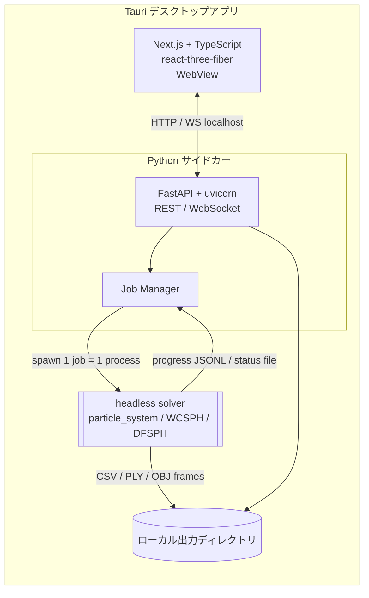

# SPH シミュレータ GUI アプリケーション 開発仕様書

- 作成日: 2026-07-30
- プロジェクト: 既存 `SPH_Taichi`（Vulkan ウィンドウ描画）を、GUI 付きデスクトップアプリへ再構成
- 公開先: anene000 の GitHub（新規リポジトリ）
- 技術スタック: **TypeScript + Next.js（フロント）／ Python（ソルバ・バックエンド）／ Tauri（デスクトップ shell）**

---

## 1. 目的・背景

現状の SPH ソルバは `ti.ui.Window`（Vulkan）でウィンドウ描画しながら実行する形態で、
設定は JSON を手書きし CLI 起動する必要がある。本開発では以下を実現する。

- 解析空間・オブジェクト・計算パラメータ・出力設定を **GUI で編集**。
- ソルバは **ヘッドレス実行**（ウィンドウ描画を切り離す）。
- 計算の **進捗をリアルタイム表示**、結果を **3D 再生** と **CSV 出力**で扱う。
- 設定は **JSON でインポート／エクスポート**（①）。②〜⑥の操作で①の JSON を自動生成。

---

## 2. 実行形態・全体アーキテクチャ

**デスクトップアプリ（Tauri v2）** として配布する。フロントは Next.js の静的出力、
バックエンドは Python(FastAPI) を **サイドカー**として同梱し、ソルバは**ジョブ単位の
サブプロセス**として起動する。



### 2.1 コンポーネント責務
| レイヤ | 技術 | 責務 |
|--------|------|------|
| Desktop shell | Tauri v2 (Rust) | ウィンドウ生成、フロント配信、Python サイドカー起動/停止、ファイルダイアログ、パス許可 |
| Frontend | Next.js(SSG) + TypeScript + React | 全画面 UI、フォーム、3D プレビュー/再生、進捗表示、API 呼び出し |
| Backend | Python 3 + FastAPI + uvicorn | 設定検証、ジョブ管理、進捗中継(WS)、結果配信、CSV/ファイル入出力 |
| Solver | 既存 Taichi コード（headless 化） | SPH 計算本体、進捗出力、CSV/PLY/OBJ フレーム出力 |

### 2.2 なぜこの構成か
- **Tauri**: Electron より軽量。Next.js 静的出力をそのまま WebView 配信でき、Python をサイドカーにできる。
- **FastAPI サイドカー**: フロントと疎結合。REST + WebSocket で進捗中継が容易。PyInstaller で単一バイナリ化して同梱。
- **サブプロセス（ジョブ単位）**: Taichi の再初期化やクラッシュがバックエンド本体に波及しない。キャンセルはプロセス終了で確実。

---

## 3. 技術スタック詳細

### 3.1 Frontend
| 用途 | ライブラリ |
|------|-----------|
| フレームワーク | Next.js（`output: 'export'` 静的出力） + TypeScript |
| 3D | `three`, `@react-three/fiber`, `@react-three/drei`（OBJ ローダ・OrbitControls・Points） |
| 状態管理 | Zustand |
| フォーム/検証 | react-hook-form + zod（JSON スキーマと同型のバリデーション） |
| UI | Tailwind CSS + shadcn/ui（または MUI） |
| 通信 | fetch（REST）、ネイティブ WebSocket（進捗） |

### 3.2 Backend
| 用途 | ライブラリ |
|------|-----------|
| Web | FastAPI, uvicorn |
| 検証 | Pydantic v2（Scene/Params/Export モデル） |
| ジョブ | `subprocess`（solver 起動）, `asyncio`（進捗中継） |
| パッケージ | PyInstaller（Tauri sidecar バイナリ化） |

### 3.3 Solver（既存資産の再利用）
- `particle_system.py` / `WCSPH.py` / `DFSPH.py` / `sph_base.py` はロジックを維持。
- **ヘッドレス実行スクリプト `solver/run_headless.py` を新規追加**（`ti.ui.Window` に依存しない）。
- 進捗は **標準出力に JSON Lines**（`{"type":"progress","step":..,"simTime":..,"eta":..}`）で出力し、Job Manager が読み取る。

---

## 4. データモデル

### 4.1 シーン設定 JSON（既存スキーマを拡張）
既存の `Configuration` / `RigidBodies` / `FluidBlocks` / `RigidBlocks` に加え、
出力設定 `Export` を追加する（②〜⑥の GUI 操作から自動生成）。

```jsonc
{
  "Configuration": {
    "domainStart": [0,0,0], "domainEnd": [4,2,1],
    "particleRadius": 0.01, "simulationMethod": 0,
    "timeStepSize": 0.0004, "gravitation": [0,-9.8,0],
    "density0": 1000, "stiffness": 10000, "exponent": 5,
    "boundaryHandlingMethod": 2,
    "enforceDomainFit": true,
    "numberOfStepsPerRenderUpdate": 1,
    "totalTime": 5.0            // 追加: 総計算時間（または totalSteps）
  },
  "RigidBodies": [ { "objectId":1, "geometryFile":"models/xxx.obj",
                     "translation":[3,1.25,0.5], "scale":[0.01,0.01,0.65],
                     "rotationAxis":[1,0,0], "rotationAngle":0,
                     "velocity":[0,0,0], "density":1000, "color":[255,255,255],
                     "isDynamic":false } ],
  "FluidBlocks": [ { "objectId":0, "start":[0,0,0], "end":[1,2,1],
                     "translation":[0,0,0], "scale":[1,1,1],
                     "velocity":[0,1,0], "density":1000, "color":[50,100,200] } ],

  "Export": {                                   // 追加セクション（結果出力）
    "outputDir": "outputs/<job_id>",
    "interval": { "mode": "steps", "value": 40 },   // "steps" or "time"
    "fluid": {                                        // 流体パーティクル追跡
      "enabled": true,
      "objectIds": [0],
      "fields": ["position","velocity","density","pressure"],
      "format": "csv"
    },
    "objects": [                                      // オブジェクトモデル追跡（別個）
      { "objectId": 1, "mode": "meshVertices", "fields":["position"], "format":"csv" }
    ],
    "ply": false, "obj": false
  }
}
```

### 4.2 CSV 出力仕様（操作例の要件）
「流体パーティクルのみ追跡」「オブジェクトモデル追跡は別個・ユーザー指定」「時間刻みごと出力」を満たす。

- **出力単位**: `Export.interval`（ステップ数 or シミュレーション時間刻み）ごとに 1 フレーム。
- **流体 CSV**: `fluid_<objectId>_<frame:06>.csv`
  - 列例: `particle_id,x,y,z,vx,vy,vz,density,pressure`（`fields` に応じて列を増減）
- **オブジェクト CSV**: `object_<objectId>_<frame:06>.csv`（`mode` により中身が異なる）
  - `mode="particles"`: 剛体粒子座標 `particle_id,x,y,z`
  - `mode="meshVertices"`: メッシュ頂点座標 `vertex_id,x,y,z`（動的剛体の姿勢追跡向け）
- **フレーム索引**: `frames.json`（frame → simTime, 生成 CSV パスの対応表）。
- 追跡対象・列・間隔はすべて **GUI（出力設定画面）で指定**。

### 4.3 ジョブモデル（バックエンド内部）
```
Job { id, configPath, status(queued|running|completed|failed|canceled),
      progress{step,totalSteps,simTime,totalTime,eta,elapsed},
      outputDir, log[], createdAt, finishedAt, error? }
```

---

## 5. API 設計（localhost, サイドカー）

| メソッド | パス | 用途 | 機能番号 |
|----------|------|------|:---:|
| POST | `/api/config/import` | JSON アップロード→検証・正規化して返す | ① |
| POST | `/api/config/export` | 現在の設定を JSON 化して保存パスへ書き出し | ① |
| POST | `/api/config/validate` | domain フィット検証（既存 `_check_object_fits_domain` を流用）→ 推奨倍率 | ③ |
| GET/POST | `/api/models` | `.obj` 一覧取得 / アップロード | ② |
| GET | `/api/models/:id/preview` | プレビュー用メッシュ（bbox・簡略頂点） | ②③ |
| POST | `/api/jobs` | 設定を受け取り **JSON を自動生成・保存**しジョブ起動 | ⑤ |
| GET | `/api/jobs` `/api/jobs/:id` | ジョブ一覧・状態取得 | ⑥ |
| POST | `/api/jobs/:id/cancel` | ジョブ（サブプロセス）中断 | ⑥ |
| WS | `/ws/jobs/:id` | 進捗・ログのストリーム配信 | ⑥ |
| GET | `/api/jobs/:id/frames` | 結果フレーム一覧（frames.json） | 結果 |
| GET | `/api/jobs/:id/frames/:frame` | 3D 再生用の粒子座標（バイナリ/JSON） | 結果 |
| GET | `/api/jobs/:id/download` | CSV 一式（zip）ダウンロード | 結果 |

### 5.1 「JSON 自動生成」の流れ（操作例の中核）
`POST /api/jobs` は、GUI 各画面（②〜④＋出力設定）の状態を集約した設定オブジェクトを受け取り、
`Export.outputDir` 配下に **`scene.json`（＝①の設定ファイル）を書き出してから**ソルバを起動する。
これにより「②〜⑥を実行すると①が自動作成される」を満たす。

---

## 6. ソルバのヘッドレス化（重要）

`run_simulation.py`（Vulkan ウィンドウ）から描画を分離した `solver/run_headless.py` を用意する。

- 入力: `--scene_file scene.json --output_dir <dir>`
- 処理: `ParticleSystem`→`build_solver`→ループで `solver.step()`。
  - `Export.interval` ごとに `ps.dump()` 等から **CSV フレーム書き出し**。
  - 進捗を **標準出力に JSON Lines** で出力（step, simTime, eta, particleNum）。
  - `enforceDomainFit` により超過時は推奨倍率を出力し非0終了（GUI がメッセージを提示）。
- 描画依存（`ti.ui.*`）を含めない。GPU が使えない環境では CPU arch にフォールバック。
- 既存の `run_nowindow_simulation*.py` を土台にリファクタして流用する。

---

## 7. リポジトリ構成（モノレポ案）

```
sph-studio/                     # 新規リポジトリ（anene000）
├─ apps/
│  ├─ desktop/                  # Tauri v2（Rust shell, tauri.conf, sidecar 定義）
│  └─ web/                      # Next.js + TypeScript フロント
├─ backend/                     # FastAPI サイドカー（Pydantic モデル, job manager）
├─ solver/                      # 既存 Taichi コード + run_headless.py
│  ├─ particle_system.py, WCSPH.py, DFSPH.py, sph_base.py, config_builder.py
│  └─ run_headless.py
├─ data/
│  ├─ models/  (.obj)           # サンプルメッシュ
│  └─ scenes/  (.json)          # サンプルシーン
├─ docs/                        # 本計画文書一式
├─ scripts/                     # 開発/ビルド/パッケージ用スクリプト
└─ README.md                    # LINUX / Windows 実行手順（機能⑦）
```

---

## 8. 非機能・制約

| 項目 | 方針 |
|------|------|
| 対応 OS | Linux（主）/ Windows（対応）。README に両手順（⑦） |
| GPU/CPU | Vulkan 優先、無ければ CPU フォールバック |
| 同時実行 | ローカル単一利用想定。ジョブは逐次（キュー）を基本、並列は将来拡張 |
| セキュリティ | localhost バインドのみ。外部公開しない。ファイルアクセスは Tauri の許可パス内 |
| 大規模結果 | CSV はフレーム分割。3D 再生はダウンサンプリング/間引き対応 |
| 依存管理 | フロント: pnpm / バック: uv or venv + requirements |

---

## 9. リスクと対策

| リスク | 対策 |
|--------|------|
| Python ランタイム同梱の複雑さ（Tauri sidecar） | PyInstaller でワンバイナリ化。CI でOS別ビルド。初期は「別プロセス起動」方式で先行検証 |
| Taichi/Vulkan の環境差 | CPU フォールバックを既定に。README に GPU セットアップ手順 |
| 大量粒子の 3D 再生負荷 | Points（インスタンシング）＋フレーム間引き＋LOD |
| 長時間計算の進捗/中断 | サブプロセス＋WS 進捗＋プロセス kill による確実な cancel |
| 既存ソルバの描画依存 | `run_headless.py` で描画を完全分離（本仕様書 §6） |
