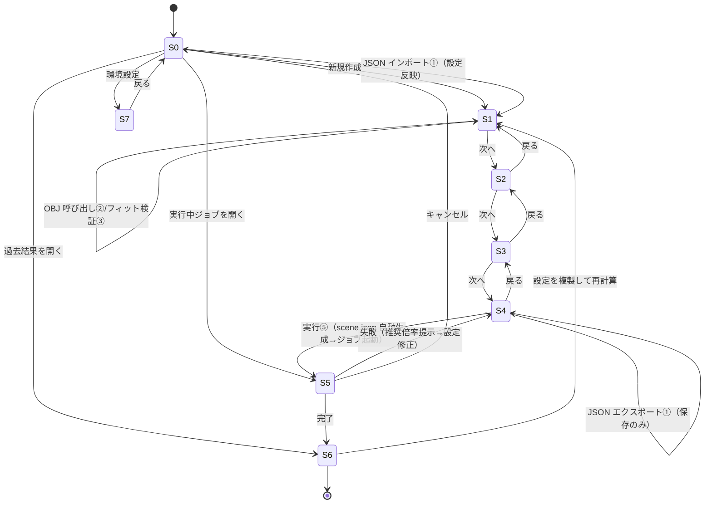
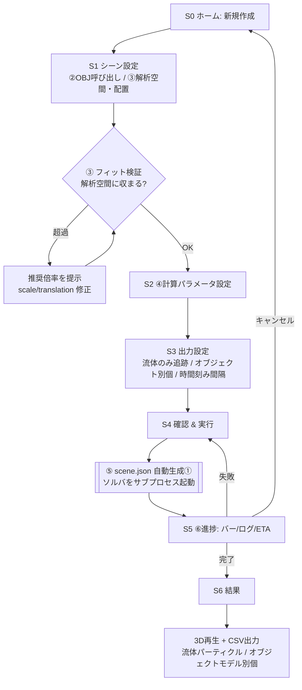
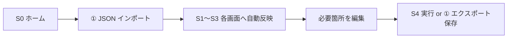
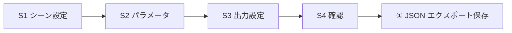
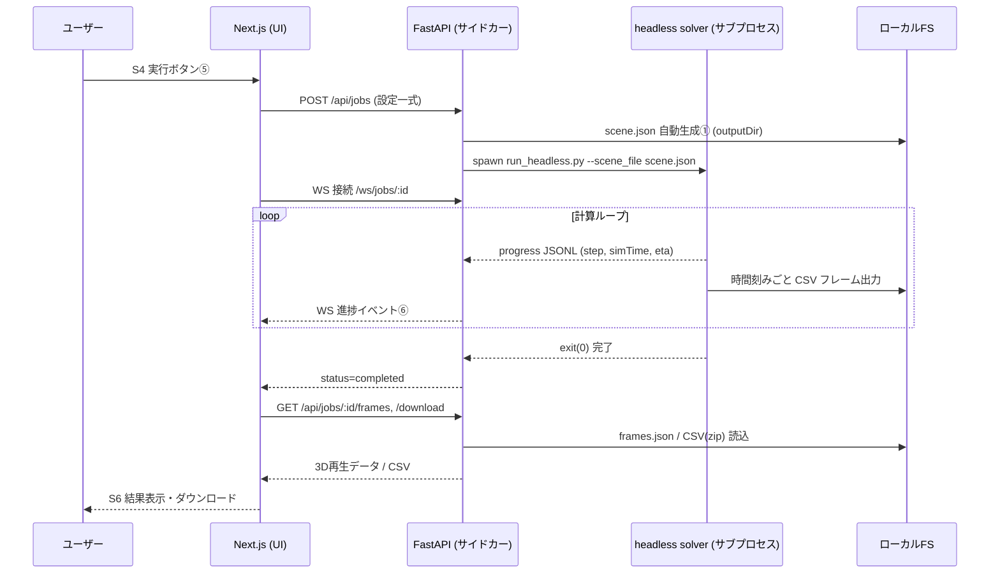

# ユーザーフロー・画面遷移図

- 作成日: 2026-07-30
- 対象: SPH シミュレータ GUI アプリケーション

---

## 1. 画面一覧

| # | 画面 | 対応機能 | 概要 |
|---|------|---------|------|
| S0 | ホーム / プロジェクト一覧 | ① | 新規作成・既存 JSON を開く・過去ジョブ一覧 |
| S1 | シーン設定（解析空間＋オブジェクト） | ②③ | 3D プレビュー、domain・OBJ 配置・フィット検証 |
| S2 | 計算パラメータ設定 | ④ | ソルバ・時間刻み・重力・係数・総計算時間 |
| S3 | 出力設定 | ⑤(出力) | 追跡対象（流体/オブジェクト別個）・列・時間刻み間隔 |
| S4 | 確認 & 実行 | ⑤ | 設定レビュー → JSON 自動生成 → ジョブ起動 |
| S5 | 進捗 | ⑥ | 進捗バー・ライブログ・ETA・キャンセル |
| S6 | 結果 | 結果 | 3D 再生・フレームスクラバ・CSV ダウンロード |
| S7 | 設定（環境） | ⑦補助 | Python パス・出力先・GPU/CPU 既定 |

---

## 2. 画面遷移図



---

## 3. 主要ユーザーフロー

### 3.1 初回・新規計算（操作例の主シナリオ）
「②〜⑥を実行すると①の設定ファイルが自動作成される」を満たすフロー。



### 3.2 既存設定を使う（JSON インポート）


### 3.3 設定だけ作って保存（計算しない）


### 3.4 計算結果データの取得（操作例の後半）
```mermaid
flowchart TD
  A[S6 結果画面] --> B{追跡対象を選択}
  B --> C[流体パーティクルのみ<br/>fluid_<id>_<frame>.csv]
  B --> D[オブジェクトモデル別個<br/>object_<id>_<frame>.csv<br/>ユーザー指定 objectId]
  C --> E[時間刻みごとフレーム]
  D --> E
  E --> F[個別 or 一括(zip) ダウンロード]
  A --> G[3D 再生・フレームスクラバ]
```

---

## 4. 状態・データの流れ（実行時シーケンス）



---

## 5. 画面ワイヤフレーム（レイアウト方針・テキスト版）

- **S1 シーン設定**: 左=設定パネル（domain / オブジェクト一覧・パラメータ）、中央=3D ビュー、右=フィット検証結果（推奨倍率）。
- **S3 出力設定**: 追跡対象トグル（流体 / 各オブジェクト）、列チェックボックス、間隔（ステップ/時間）入力。
- **S5 進捗**: 上=進捗バー＋ETA、中=指標カード（step/simTime/粒子数）、下=ライブログ、右上=キャンセル。
- **S6 結果**: 中央=3D 再生＋スクラバ（再生/停止/フレーム）、右=フレーム表、下=CSV ダウンロード群。
