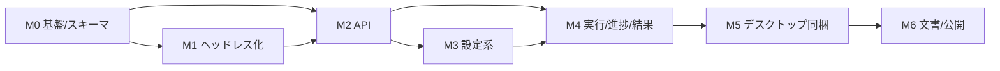

# 開発ワークフロー計画

- 作成日: 2026-07-30
- 対象: SPH シミュレータ GUI アプリケーション（Tauri + Next.js + Python）
- 公開先: anene000 の GitHub 新規リポジトリ `sph-studio`（名称は仮）

---

## 1. 開発方針

- **段階リリース**: まず CLI ヘッドレス化とバックエンド API を固め、次に GUI、最後にデスクトップ同梱。
- **契約優先**: シーン JSON スキーマ（zod ⇔ Pydantic）を最初に確定し、フロント/バックを並行開発。
- **ローカル完結・単一利用**を前提に、認証やマルチテナントは作らない（将来拡張として明記）。

---

## 2. マイルストーン

| MS | 名称 | 主要成果物 | 対応機能 | 目安 |
|----|------|-----------|:---:|:---:|
| M0 | 基盤整備 | モノレポ雛形、CI、スキーマ定義、サンプルデータ移設 | – | 1週 |
| M1 | ソルバ ヘッドレス化 | `solver/run_headless.py`、進捗 JSONL、CSV フレーム出力 | ⑤⑦ | 1–2週 |
| M2 | バックエンド API | FastAPI（import/export/validate/jobs/WS） | ①③⑤⑥ | 1–2週 |
| M3 | フロント設定系 | S0–S4、3D プレビュー、フィット検証 UI | ①②③④ | 2–3週 |
| M4 | 実行・進捗・結果 | S5 進捗（WS）、S6 3D 再生・CSV DL | ⑤⑥＋結果 | 2週 |
| M5 | デスクトップ同梱 | Tauri 化、Python サイドカー(PyInstaller)、OS別ビルド | – | 1–2週 |
| M6 | ドキュメント・公開 | README(Linux/Windows)、リリース、anene000 へ push | ⑦ | 1週 |

> 目安は逐次実行時の相対見積り。M3/M4 は M1/M2 完了後にフロント・バック並行可。

---

## 3. フェーズ別タスク分解

### M0 基盤整備
- [ ] モノレポ作成（`apps/desktop`, `apps/web`, `backend`, `solver`, `data`, `docs`, `scripts`）
- [ ] pnpm ワークスペース / Python 仮想環境（uv or venv）
- [ ] 既存 `particle_system.py` 他を `solver/` へ移設（本改修版を使用）
- [ ] **シーン JSON スキーマ確定**（Export セクション込み）→ zod / Pydantic 双方生成
- [ ] CI: lint(eslint/ruff)・typecheck(tsc/mypy)・test(pytest/vitest)・build

### M1 ソルバ ヘッドレス化
- [ ] `run_headless.py`（`ti.ui` 非依存、`--scene_file --output_dir`）
- [ ] 進捗を標準出力へ JSON Lines 出力
- [ ] `Export.interval` ごとに流体 CSV / オブジェクト CSV 出力（別個）
- [ ] `frames.json` 生成、`enforceDomainFit` 超過時の非0終了＋推奨倍率出力
- [ ] CPU フォールバック確認（Vulkan 無し環境）

### M2 バックエンド API
- [ ] Pydantic モデル（Configuration/RigidBodies/FluidBlocks/Export）
- [ ] `/api/config/import|export|validate`（validate は既存フィット検証を流用）
- [ ] `/api/models`（一覧/アップロード/プレビュー）
- [ ] Job Manager（subprocess 起動・状態・cancel）
- [ ] `/ws/jobs/:id` 進捗中継、`/api/jobs/:id/frames|download`

### M3 フロント設定系
- [ ] レイアウト・ルーティング（S0–S7）、Zustand ストア
- [ ] S1: react-three-fiber で domain 枠＋OBJ 表示、配置/スケール編集の即時反映
- [ ] S1: フィット検証呼び出し→推奨倍率表示・適用
- [ ] S2/S3: パラメータ・出力設定フォーム（zod 検証）
- [ ] ①インポート/エクスポート UI

### M4 実行・進捗・結果
- [ ] S4: レビュー→`POST /api/jobs`（JSON 自動生成→起動）
- [ ] S5: WS 進捗バー・ライブログ・ETA・キャンセル
- [ ] S6: フレームスクラバ 3D 再生、CSV 個別/一括 DL、frames 表

### M5 デスクトップ同梱
- [ ] Tauri v2 セットアップ、Next.js 静的出力を配信
- [ ] Python を PyInstaller で sidecar 化、`tauri.conf` 登録・起動/終了管理
- [ ] ファイルダイアログ/許可パス、OS 別ビルド（Linux/Windows）

### M6 ドキュメント・公開
- [ ] README（⑦ Linux/Windows 手順、設定解説、トラブルシュート）
- [ ] サンプルシーンで E2E 動作確認
- [ ] anene000 GitHub へ初回 push・リリースタグ

---

## 4. 依存関係（クリティカルパス）



M1（ヘッドレス化）と M2（API）が全体のクリティカルパス。スキーマ確定（M0）を最優先。

---

## 5. リポジトリ運用・Git ワークフロー

- **ブランチ**: トランクベース。`main` を保護、機能は `feat/*` `fix/*` の短命ブランチ→PR。
- **コミット規約**: Conventional Commits（`feat:`, `fix:`, `docs:`, `chore:` …）。
- **PR**: CI 必須通過（lint/type/test/build）、レビュー後 squash merge。
- **タグ/リリース**: `vX.Y.Z`、OS 別成果物を Release に添付。
- **初回公開手順（案）**:
  ```bash
  # ローカルで新規リポジトリとして初期化（現行フォークとは別リポジトリ）
  git init
  git add .
  git commit -m "chore: initial import of sph-studio"
  git branch -M main
  git remote add origin git@github.com:anene000/sph-studio.git
  git push -u origin main
  ```
  ※ 既存 `SPH_Taichi` は upstream 切断済みの独自フォーク。ソルバコードはここから移設する。

---

## 6. CI/CD

| ステージ | 内容 |
|----------|------|
| Lint | eslint / ruff |
| 型 | tsc --noEmit / mypy |
| テスト | vitest（フロント）/ pytest（バック・ソルバ） |
| ビルド | Next.js export / FastAPI 起動スモーク / Tauri build（OS matrix） |
| 成果物 | Linux(AppImage/deb) / Windows(msi/exe) を Release へ |

---

## 7. テスト戦略

| レベル | 対象 | 例 |
|--------|------|----|
| 単体 | スキーマ変換、フィット検証、CSV 出力整形 | 推奨倍率計算（既検算値と一致）、JSON 往復 |
| 結合 | API × ソルバ（サブプロセス） | 小規模シーンで数ステップ実行→CSV/frames 生成 |
| E2E | GUI 主要フロー | 新規計算フロー（②〜⑥→CSV）をヘッドレスブラウザで検証 |
| 手動 | 3D 表示・OS 別動作 | Linux/Windows で起動・計算・再生・DL |

---

## 8. 完了の定義（DoD）

- 機能 ①〜⑦ の受入基準（機能一覧書）をすべて満たす。
- 「②〜⑥実行で scene.json 自動生成→計算→時間刻みごと CSV（流体のみ／オブジェクト別個）出力」が通しで動作。
- README のみで Linux・Windows 双方の環境構築・起動・サンプル計算が完了。
- anene000 の GitHub にリポジトリが公開され、Release 成果物が添付されている。

---

## 9. 未決事項・要確認（次段階で確定）

- リポジトリ名（`sph-studio` 仮）。
- Tauri と PyInstaller 同梱の詳細（初期は「Python を別プロセス起動」でも可）。
- 3D 再生の粒子上限・間引き基準（性能要件）。
- CSV 列の最終セット（`fields` の既定値）。
